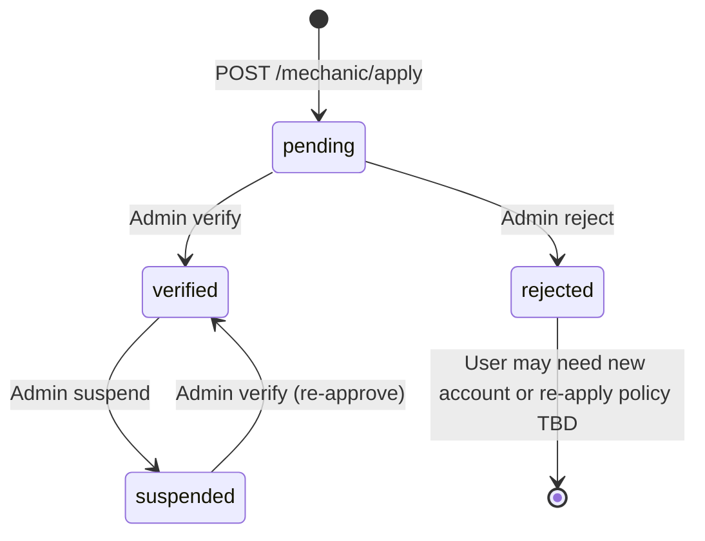

# Mechanics — Roles & Identity

This document describes the mechanic marketplace **foundation** added to Auto-Store API: roles, profiles, verification workflow, and endpoints.

For request/response examples, see [sample-payloads.md](./sample-payloads.md#mechanics).  
For the endpoint table, see [endpoints.md](./endpoints.md#mechanics-apiv1mechanics-apiv1mechanic).

---

## Overview

The API distinguishes **who someone is** (user `role`) from **whether they are approved to work as a mechanic** (profile `status`).

- **Customers** buy parts as today.
- **Mechanics** are installers vetted through an application and admin approval flow.
- **Installation marketplace** (quotes, bookings) requires a **verified** mechanic profile via `RequireVerifiedMechanic` middleware. See [installation-marketplace.md](./installation-marketplace.md).
- Future **Community Q&A** answers will use the same middleware.

---

## User roles

| Role | Constant | Typical use |
|------|----------|-------------|
| Admin | `ADMIN` | Platform administration, verify mechanics |
| Vendor | `VENDOR` | Sell parts, manage catalog |
| Customer | `CUSTOMER` | Shop, apply to become a mechanic |
| Mechanic | `MECHANIC` | Verified installer (after admin approval) |

Roles are stored in uppercase on the `users` table. JWT access tokens include `role` in claims.

Admins can assign any valid role with:

```
PUT /api/v1/admin/users/:id/role
```

Valid values: `ADMIN`, `VENDOR`, `CUSTOMER`, `MECHANIC`.

---

## Data model

### `mechanic_profiles`

One profile per user (`user_id` unique).

| Field | Description |
|-------|-------------|
| `business_name` | Shop or trading name |
| `bio` | Short description |
| `phone`, `street`, `city`, `state`, `postal_code`, `country` | Contact and service location |
| `latitude`, `longitude` | Optional coordinates for geo matching |
| `service_radius_km` | How far they travel (default 25) |
| `status` | `pending`, `verified`, `suspended`, `rejected` |
| `rating_avg`, `rating_count` | Reserved for future reviews |
| `verified_at`, `suspended_at` | Audit timestamps |
| `rejection_reason` | Set on suspend/reject (admin) |

### `mechanic_documents`

Verification files linked to a profile.

| Field | Description |
|-------|-------------|
| `document_type` | `license`, `insurance`, `certification`, `other` |
| `url` | Public URL (e.g. S3 after upload) |
| `file_name` | Original filename |
| `status` | `pending`, `approved`, `rejected` (document-level review; profile verify is separate) |

---

## Verification workflow



| Step | Actor | Action | Role after |
|------|-------|--------|------------|
| 1 | User | `POST /mechanic/apply` | Stays `CUSTOMER` |
| 2 | Admin | `GET /admin/mechanics?status=pending` | — |
| 3 | Admin | `PUT /admin/mechanics/:userId/verify` | `MECHANIC` |
| Alt | Admin | `PUT .../reject` with `reason` | `CUSTOMER` if was mechanic |
| Alt | Admin | `PUT .../suspend` | Stays `MECHANIC`, not publicly listed |

Only profiles with `status = verified` appear on:

- `GET /api/v1/mechanics`
- `GET /api/v1/mechanics/:id`

---

## API surface

### Public

| Method | Path | Description |
|--------|------|-------------|
| GET | `/api/v1/mechanics` | Paginated verified mechanics |
| GET | `/api/v1/mechanics/:id` | Single verified profile (profile UUID) |

### Authenticated (any logged-in user)

| Method | Path | Description |
|--------|------|-------------|
| POST | `/api/v1/mechanic/apply` | Submit application |
| GET | `/api/v1/mechanic/profile` | Own profile + documents |
| PUT | `/api/v1/mechanic/profile` | Update (pending or verified only) |
| POST | `/api/v1/mechanic/documents` | Add document |
| DELETE | `/api/v1/mechanic/documents/:id` | Remove document |

### Admin

| Method | Path | Description |
|--------|------|-------------|
| GET | `/api/v1/admin/mechanics` | List/filter by status |
| PUT | `/api/v1/admin/mechanics/:userId/verify` | Approve |
| PUT | `/api/v1/admin/mechanics/:userId/suspend` | Suspend |
| PUT | `/api/v1/admin/mechanics/:userId/reject` | Reject (reason required) |

Path parameter `:userId` is the **user** UUID, not the mechanic profile UUID.

---

## User profile integration

`GET /api/v1/users/me` includes an optional summary when a mechanic profile exists:

```json
"mechanic_profile": {
  "id": "<profile-uuid>",
  "status": "pending",
  "business_name": "Bay Area Brakes",
  "is_verified": false
}
```

Auth middleware preloads `MechanicProfile` on authenticated requests so this is available without an extra call.

---

## Middleware (for future features)

`RequireVerifiedMechanic` in `internal/middleware/auth.go` requires:

1. `user.role == MECHANIC`
2. A `mechanic_profiles` row for the user with `status == verified`

Use this on routes such as answering Q&A or accepting installation jobs. Example (not wired yet):

```go
protected.Use(middleware.RequireVerifiedMechanic(db))
```

---

## Implementation layout

| Layer | Files |
|-------|--------|
| Models | `internal/models/user.go`, `mechanic_profile.go`, `role.go` |
| Repository | `internal/repositories/mechanic_repository.go` |
| Service | `internal/services/mechanic_service.go` |
| Handlers | `internal/handlers/mechanic_handler.go` |
| DTOs | `internal/handlers/dto/dto.go` (Mechanic* types) |
| Routes | `internal/router/router.go` |
| Migrations | GORM `AutoMigrate` in `internal/database/database.go` |

---

## Document uploads

The apply and document endpoints expect **URLs** to files already stored (e.g. via existing `POST /api/v1/upload/images` for Admin/Vendor, or direct S3 upload from a future mechanic upload flow). Pass those URLs in `documents[].url` or `POST /mechanic/documents`.

---

## Related changes

- **RBAC:** `MECHANIC` added to `UpdateRole` validation and admin role endpoint.
- **README:** Mechanics feature bullet and API overview row.
- **Tests:** `internal/models/role_test.go` for role and status validation.
