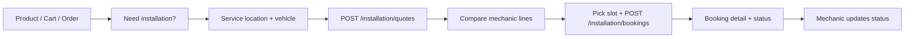

# Next.js Frontend Prompt — Installation Marketplace

Use this document to implement the **Installation Marketplace** in the Auto-Store web frontend. It extends the base contract in [nextjs-frontend-prompt.md](./nextjs-frontend-prompt.md) (auth envelope, Tailwind minimalist design, API client). Backend reference: [installation-marketplace.md](./installation-marketplace.md), [mechanics.md](./mechanics.md), [sample-payloads.md](./sample-payloads.md#installation-marketplace).

---

## 1. What to build

**Installation Marketplace** lets customers who buy (or are buying) installation-eligible parts request **labor quotes** from nearby **verified mechanics**, compare offers, **book an appointment**, and track the job through completion.

| Persona | Capability |
|---------|------------|
| **Guest** | Browse verified mechanics (`GET /mechanics`), view public profiles |
| **Customer** | Request quotes, compare lines, book slot, view/cancel bookings |
| **Applicant** | Apply to become a mechanic (`POST /mechanic/apply`) — see [mechanics.md](./mechanics.md) |
| **Verified mechanic** | View quote lines, adjust labor estimate, manage offered job types, update booking status |
| **Admin** | Verify mechanics (prerequisite for marketplace) — existing admin routes |

**Payments:** **Paystack is planned but not implemented** on the API yet. Bookings are created with `status: pending_payment` and `payment_status: pending`. Do **not** build Paystack checkout until the backend exposes initialize/verify/webhook endpoints. For now, show clear copy: *“Payment collected separately — your booking is reserved pending confirmation.”* Leave a **stub** Paystack step in the booking wizard (disabled button or “Coming soon”) so the UI flow is ready to wire later.

**Distinct from:**
- **Product reviews** (stars after purchase)
- **Community Q&A** ([nextjs-community-qa-prompt.md](./nextjs-community-qa-prompt.md))
- **Parts checkout** (`POST /orders`) — installation can attach to an order or standalone products

---

## 2. User journey (high level)



1. Customer sees **“Book installation”** on eligible products, cart, or order confirmation.
2. Wizard collects **vehicle** (make, model, year), **service address**, and **coordinates** (lat/lng).
3. API returns quote with multiple **lines** (mechanic, labor price, distance, ETA hours).
4. Customer selects one line + **scheduled_at** → booking created.
5. Customer and mechanic receive **notifications**; both track status on dashboard pages.

---

## 3. API contract

Base URL: `NEXT_PUBLIC_API_URL/api/v1`. Standard envelope: `success`, `data`, `error`, `errors`, `meta`. See [nextjs-frontend-prompt.md §3](./nextjs-frontend-prompt.md#3-backend-api-contract).

### Endpoints

| Method | Path | Auth | Notes |
|--------|------|------|--------|
| GET | `/installation/job-types` | No | Catalog for labels and mechanic service picker |
| GET | `/mechanics` | No | Verified mechanics list; query: `page`, `limit` |
| GET | `/mechanics/:id` | No | Public profile (`:id` = **profile UUID**) |
| POST | `/installation/quotes` | Yes | Create quote request |
| GET | `/installation/quotes` | Yes | Customer’s quotes (paginated) |
| GET | `/installation/quotes/:id` | Yes | Quote + `lines[]` |
| POST | `/installation/bookings` | Yes | Book selected line |
| GET | `/installation/bookings` | Yes | Customer bookings |
| GET | `/installation/bookings/:id` | Yes | Booking detail |
| PATCH | `/installation/bookings/:id/cancel` | Yes | Optional body: `{ "reason": "..." }` |
| GET | `/mechanic/installation/quotes` | Verified mechanic | Quote lines for this mechanic |
| PATCH | `/mechanic/installation/quotes/:id` | Verified mechanic | Update labor / message (`:id` = **line UUID**) |
| PUT | `/mechanic/installation/services` | Verified mechanic | Body: `{ "job_type_ids": ["..."] }` |
| GET | `/mechanic/installation/bookings` | Verified mechanic | Mechanic’s bookings |
| GET | `/mechanic/installation/bookings/:id` | Verified mechanic | Booking detail |
| PATCH | `/mechanic/installation/bookings/:id/status` | Verified mechanic | Body: `{ "status": "en_route" }` |

**Verified mechanic** = `user.role === "MECHANIC"` **and** `user.mechanic_profile?.is_verified === true` (same rule as Q&A answers).

### Create quote (`POST /installation/quotes`)

Requires **either** `order_id` **or** `product_ids` (non-empty). **Latitude and longitude are required** for matching.

```json
{
  "product_ids": ["550e8400-e29b-41d4-a716-446655440010"],
  "vehicle_make": "Toyota",
  "vehicle_model": "Camry",
  "vehicle_year": 2018,
  "service_street": "123 Main St",
  "service_city": "San Jose",
  "service_state": "CA",
  "service_postal_code": "95112",
  "service_country": "US",
  "latitude": 37.3382,
  "longitude": -121.8863,
  "notes": "Front brake pads — driveway access",
  "search_radius_km": 50
}
```

Or after checkout:

```json
{
  "order_id": "660e8400-e29b-41d4-a716-446655440099",
  "vehicle_make": "Toyota",
  "vehicle_model": "Camry",
  "vehicle_year": 2018,
  "service_city": "San Jose",
  "service_state": "CA",
  "service_postal_code": "95112",
  "latitude": 37.3382,
  "longitude": -121.8863
}
```

**Success (201):** `data` = quote object with `lines[]`, `expires_at` (24h), `status: "ready"`.

**Errors to handle:**

| HTTP / message | UX |
|----------------|-----|
| 400 `latitude and longitude are required` | Block submit until geocoded |
| 400 `no installation-eligible products found` | Explain product must support install |
| 400 `no verified mechanics available in your area` | Empty state + widen radius suggestion |
| 404 order not found / not owned | Redirect or error toast |

### Quote line shape (`lines[]`)

```json
{
  "id": "770e8400-e29b-41d4-a716-446655440101",
  "mechanic_profile_id": "880e8400-e29b-41d4-a716-446655440020",
  "mechanic_name": "Bay Area Brakes",
  "job_type_id": "...",
  "job_type_name": "Brake Pad Replacement",
  "labor_price": 120,
  "estimated_hours": 1.5,
  "mechanic_message": "Estimate based on standard labor...",
  "distance_km": 8.2,
  "status": "offered",
  "rating_avg": 4.8
}
```

Sort client-side by `labor_price`, `distance_km`, or `rating_avg` (tabs or dropdown).

### Create booking (`POST /installation/bookings`)

```json
{
  "quote_id": "660e8400-e29b-41d4-a716-446655440100",
  "quote_line_id": "770e8400-e29b-41d4-a716-446655440101",
  "scheduled_at": "2026-05-25T14:00:00Z"
}
```

Use **ISO 8601** UTC from a datetime picker (convert local → UTC before send).

**Success (201):** booking with `status: "pending_payment"`, `labor_total`, `parts_total`, `platform_fee`, `total_amount`, `payment_status: "pending"`.

### Mechanic update quote line (`PATCH /mechanic/installation/quotes/:id`)

```json
{
  "labor_price": 135,
  "estimated_hours": 2,
  "mechanic_message": "Includes rotor inspection."
}
```

All fields optional. Customer must **refresh** quote detail to see updates (no WebSocket yet).

### Mechanic booking status (`PATCH /mechanic/installation/bookings/:id/status`)

```json
{ "status": "en_route" }
```

Allowed values: `confirmed`, `en_route`, `in_progress`, `completed`, `cancelled`.

Typical progression: `pending_payment` → (ops/payment) → mechanic sets `confirmed` → `en_route` → `in_progress` → `completed`.

### Notifications

Wire the header bell using `payload.href`:

| Type | `href` (examples) | Action |
|------|-------------------|--------|
| `quote.ready` | `/installations/quotes/{quote_id}` | Open quote comparison |
| `booking.confirmed` | `/installations/bookings/{id}` (customer) or `/mechanic/bookings/{id}` (mechanic) | Open booking detail |
| `mechanic.en_route` | `/installations/bookings/{id}` | Show live status banner |

See [notifications.md](./notifications.md).

---

## 4. Product eligibility (UI gating)

Only show **“Book installation”** when the product supports it. The API model has:

- `installation_eligible: boolean`
- `installation_job_type_id: uuid | null`

Ensure `GET /products/:id` responses include these fields (they are on the Product model). If your current product DTO omits them, extend the API client types when the backend adds them to the response, or treat “install CTA” as driven by a static allowlist during dev.

**Cart:** Show install CTA only if **at least one** cart line item’s product is installation-eligible.

**Order confirmation:** If the order contains eligible items, prominent CTA: **“Get installation quotes”** with `order_id` pre-filled.

---

## 5. TypeScript types

```typescript
type QuoteStatus = "ready" | "expired" | "booked" | "cancelled";
type QuoteLineStatus = "offered" | "selected" | "declined";
type BookingStatus =
  | "pending_payment"
  | "confirmed"
  | "en_route"
  | "in_progress"
  | "completed"
  | "cancelled";
type PaymentStatus = "pending" | "paid" | "failed" | "refunded";

interface InstallationJobType {
  id: string;
  code: string;
  name: string;
  description: string;
  base_labor_minutes: number;
  base_labor_price: number;
}

interface InstallationQuoteLine {
  id: string;
  mechanic_profile_id: string;
  mechanic_name: string;
  job_type_id: string;
  job_type_name: string;
  labor_price: number;
  estimated_hours: number;
  mechanic_message: string;
  distance_km: number;
  status: QuoteLineStatus;
  rating_avg?: number;
}

interface InstallationQuote {
  id: string;
  status: QuoteStatus;
  vehicle_make: string;
  vehicle_model: string;
  vehicle_year: number;
  service_street: string;
  service_city: string;
  service_state: string;
  service_postal_code: string;
  service_country: string;
  latitude?: number;
  longitude?: number;
  notes: string;
  expires_at: string;
  lines: InstallationQuoteLine[];
  created_at: string;
}

interface InstallationBooking {
  id: string;
  quote_id: string;
  status: BookingStatus;
  scheduled_at: string;
  mechanic_profile_id: string;
  mechanic_name: string;
  service_street: string;
  service_city: string;
  service_state: string;
  service_postal_code: string;
  labor_total: number;
  parts_total: number;
  platform_fee: number;
  total_amount: number;
  payment_status: PaymentStatus;
  created_at: string;
}

interface CreateQuoteInput {
  order_id?: string;
  product_ids?: string[];
  vehicle_make: string;
  vehicle_model: string;
  vehicle_year: number;
  service_street?: string;
  service_city: string;
  service_state: string;
  service_postal_code: string;
  service_country?: string;
  latitude: number;
  longitude: number;
  notes?: string;
  search_radius_km?: number;
}

interface CreateBookingInput {
  quote_id: string;
  quote_line_id: string;
  scheduled_at: string; // ISO UTC
}
```

---

## 6. Routes (App Router)

| Route | Rendering | Purpose |
|-------|-----------|---------|
| `/installations` | Client or server | Customer hub: quotes + bookings tabs |
| `/installations/quotes` | Client | List quotes (`GET /installation/quotes`) |
| `/installations/quotes/[id]` | Client | Compare lines, book CTA |
| `/installations/quotes/new` | Client | Multi-step quote wizard |
| `/installations/bookings` | Client | List bookings |
| `/installations/bookings/[id]` | Client | Booking detail + cancel |
| `/mechanics` | Server/client | Public directory (optional) |
| `/mechanics/[id]` | Server | Public mechanic profile |
| `/mechanic` | Client | Mechanic dashboard layout (role guard) |
| `/mechanic/installation` | Client | Quotes + bookings for mechanic |
| `/mechanic/installation/quotes` | Client | Incoming quote lines |
| `/mechanic/installation/bookings` | Client | Appointments |
| `/mechanic/installation/bookings/[id]` | Client | Status actions |
| `/mechanic/installation/services` | Client | Job types offered (`PUT .../services`) |
| `/mechanic/apply` | Client | Application flow (existing) |

**Query params for wizard prefill:**

| Param | Effect |
|-------|--------|
| `?product_id=` | Pre-select product in quote wizard |
| `?order_id=` | Use order line items for quote |
| `?make=&model=&year=` | Pre-fill vehicle |

**Redirects:**

- After `POST /installation/quotes` → `/installations/quotes/[id]`
- After `POST /installation/bookings` → `/installations/bookings/[id]`

---

## 7. Pages and UI

Follow minimalist design from [nextjs-frontend-prompt.md §2](./nextjs-frontend-prompt.md#2-design-direction-minimalist--modern).

### 7.1 Product detail — installation CTA

On `GET /products/:id`, when `installation_eligible`:

- Card or banner: **“Professional installation available”**
- Short copy: verified local mechanics, transparent labor pricing
- Primary button → `/installations/quotes/new?product_id={id}`
- Secondary link → `/mechanics` (browse installers)

Hide CTA when not eligible.

### 7.2 Cart / checkout — attach install intent

**Cart page:** If any item is installation-eligible, show inline link: **“Get installation quotes for items in cart”** → wizard with `product_ids[]` from cart.

**Order confirmation** (`/orders/[id]` after `POST /orders`): Banner **“Need installation?”** → `/installations/quotes/new?order_id={id}`.

Do not block parts checkout; installation is a **follow-on flow**.

### 7.3 Quote wizard — `/installations/quotes/new`

Protected route. **Multi-step** layout (step indicator, back/next).

| Step | Fields | Notes |
|------|--------|--------|
| 1 — What | Product picker or confirm order/cart context | Read-only summary of SKUs |
| 2 — Vehicle | make, model, year | Reuse garage/vehicle picker if you have one |
| 3 — Where | street, city, state, postal_code | **Geocode** to lat/lng before submit |
| 4 — Notes | optional notes, search_radius_km (default 50) | |
| 5 — Review | Summary → Submit | `POST /installation/quotes` |

**Geolocation (critical):**

- Prefer: address autocomplete → geocode (Google Maps, Mapbox, or OpenStreetMap Nominatim).
- Fallback: browser `navigator.geolocation.getCurrentPosition` with consent (“Use my location”).
- Do not call `POST /installation/quotes` without valid `latitude` / `longitude`.

On success, redirect to quote detail. On `no verified mechanics` error, show radius slider (retry with higher `search_radius_km`) or link to `/mechanics`.

### 7.4 Quote detail — `/installations/quotes/[id]`

- Header: vehicle, service address, `expires_at` countdown (quote expires in 24h)
- Status badge: `ready` / `expired` / `booked`
- **Comparison table/cards** for each line:
  - Mechanic name (link → `/mechanics/[mechanic_profile_id]`)
  - `job_type_name`, `labor_price`, `estimated_hours`, `distance_km`, `rating_avg`
  - `mechanic_message` (truncated)
  - **Select** button → opens booking panel
- Booking panel (inline or step):
  - Datetime picker (`scheduled_at`, future only)
  - Price breakdown: labor + parts (if order-linked) + platform fee ≈ show totals after booking
  - **Confirm booking** → `POST /installation/bookings`
  - Paystack placeholder: disabled “Pay with Paystack (coming soon)”
- If `status === "expired"`: disable book; CTA “Request new quote”

Poll or refetch quote if mechanic may have updated line prices.

### 7.5 Customer bookings

**List** (`/installations/bookings`): cards with mechanic name, `scheduled_at`, status pill, `total_amount`.

**Detail** (`/installations/bookings/[id]`):

- Status timeline: `pending_payment` → `confirmed` → `en_route` → `in_progress` → `completed`
- Address, vehicle (from linked quote if you store quote_id — fetch quote or denormalize display)
- Totals: `labor_total`, `parts_total`, `platform_fee`, `total_amount`, `payment_status`
- **Cancel** if not completed → `PATCH .../cancel` with optional reason
- When `status === "en_route"`, show prominent “Mechanic is on the way” (matches notification)

### 7.6 Public mechanics directory — `/mechanics`

- `GET /mechanics` paginated cards: business name, city/state, `rating_avg`, service radius
- Detail `GET /mechanics/:id`: bio, contact, service area; no documents on public response
- CTA for logged-in users: “Request quote near this mechanic” still goes through full quote flow (API matches all nearby mechanics, not single-select)

### 7.7 Mechanic dashboard — `/mechanic/installation/*`

Guard: `role === "MECHANIC"` && `mechanic_profile.is_verified`. Else redirect to `/mechanic/apply` or profile status page.

**Quote lines** (`GET /mechanic/installation/quotes`):

- Table: date, job type, labor price, distance, status
- Row action: edit estimate → modal → `PATCH /mechanic/installation/quotes/:id`

**Services** (`/mechanic/installation/services`):

- Multi-select from `GET /installation/job-types`
- Save → `PUT /mechanic/installation/services` with `{ job_type_ids: [...] }`
- On admin verify, backend may seed all job types; allow narrowing to specialties

**Bookings** (`GET /mechanic/installation/bookings`):

- Sorted by `scheduled_at`
- Detail: customer service address (from booking), status, totals
- **Status buttons** (only valid transitions):
  - Confirm → `confirmed`
  - On the way → `en_route` (triggers customer notification)
  - Start job → `in_progress`
  - Complete → `completed`
  - Cancel → `cancelled` (confirm dialog)

Use clear labels, not raw enum strings, in the UI.

---

## 8. Auth and permissions (client)

```typescript
const isVerifiedMechanic =
  user?.role === "MECHANIC" &&
  user?.mechanic_profile?.is_verified === true;

const canRequestQuote = !!user; // any logged-in customer

const canBookQuote = (quote: InstallationQuote) =>
  quote.status === "ready" && new Date(quote.expires_at) > new Date();

const canCancelBooking = (b: InstallationBooking) =>
  b.status !== "completed" && b.status !== "cancelled";
```

API returns **403** for mechanic routes without verified profile — show friendly message + link to `/mechanic/profile`.

---

## 9. API client helpers

Extend shared `api.ts`:

```typescript
export function listInstallationJobTypes() {
  return api.get<InstallationJobType[]>("/installation/job-types", { auth: false });
}

export function createInstallationQuote(body: CreateQuoteInput) {
  return api.post<InstallationQuote>("/installation/quotes", body, { auth: true });
}

export function getInstallationQuote(id: string) {
  return api.get<InstallationQuote>(`/installation/quotes/${id}`, { auth: true });
}

export function listInstallationQuotes(page = 1, limit = 20) {
  return api.get<InstallationQuote[]>(`/installation/quotes?page=${page}&limit=${limit}`, { auth: true });
}

export function createInstallationBooking(body: CreateBookingInput) {
  return api.post<InstallationBooking>("/installation/bookings", body, { auth: true });
}

export function getInstallationBooking(id: string) {
  return api.get<InstallationBooking>(`/installation/bookings/${id}`, { auth: true });
}

export function listInstallationBookings(page = 1, limit = 20) {
  return api.get<InstallationBooking[]>(`/installation/bookings?page=${page}&limit=${limit}`, { auth: true });
}

export function cancelInstallationBooking(id: string, reason?: string) {
  return api.patch<InstallationBooking>(`/installation/bookings/${id}/cancel`, { reason }, { auth: true });
}

// Mechanic (verified)
export function listMechanicInstallationQuotes(page = 1, limit = 20) {
  return api.get<InstallationQuoteLine[]>(`/mechanic/installation/quotes?page=${page}&limit=${limit}`, { auth: true });
}

export function respondToInstallationQuoteLine(lineId: string, body: Partial<{ labor_price: number; estimated_hours: number; mechanic_message: string }>) {
  return api.patch(`/mechanic/installation/quotes/${lineId}`, body, { auth: true });
}

export function setMechanicInstallServices(jobTypeIds: string[]) {
  return api.put("/mechanic/installation/services", { job_type_ids: jobTypeIds }, { auth: true });
}

export function listMechanicInstallationBookings(page = 1, limit = 20) {
  return api.get<InstallationBooking[]>(`/mechanic/installation/bookings?page=${page}&limit=${limit}`, { auth: true });
}

export function updateMechanicBookingStatus(bookingId: string, status: BookingStatus) {
  return api.patch<InstallationBooking>(`/mechanic/installation/bookings/${bookingId}/status`, { status }, { auth: true });
}
```

---

## 10. State and UX details

- **Loading:** Skeleton cards on quote comparison and booking lists.
- **Errors:** Map `errors[]` to wizard fields; toast for area/no-mechanic errors.
- **Money:** Format `labor_price`, `total_amount` with `Intl.NumberFormat` (USD default; align with storefront).
- **Distance:** Show `distance_km` as “8.2 km away” (or miles if you convert for US users).
- **Expiry:** Countdown on quote detail; disable booking when expired.
- **Status badges:** Subtle pills — `pending_payment` (amber), `confirmed` (blue), `en_route` (accent), `completed` (green), `cancelled` (muted).
- **Empty states:** “No quotes yet”, “No mechanics in range — try a larger radius”.
- **No realtime:** Refetch on focus or manual refresh; mechanic price updates are not pushed.

---

## 11. Paystack (future — do not implement yet)

When the backend adds Paystack:

1. After `POST /installation/bookings`, call new endpoint e.g. `POST /installation/bookings/:id/pay` → returns Paystack `authorization_url` or `access_code`.
2. Redirect customer to Paystack hosted page or use **Paystack Inline JS** with `NEXT_PUBLIC_PAYSTACK_PUBLIC_KEY`.
3. On return, verify transaction (backend webhook sets `payment_status: paid`, booking `confirmed`).
4. Show receipt on booking detail.

Until then, document in UI that payment is pending and mechanic may confirm after offline payment.

---

## 12. Integration checklist

- [ ] Types: job type, quote, line, booking
- [ ] `GET /installation/job-types` for labels
- [ ] Product page install CTA (gated on `installation_eligible`)
- [ ] Cart + order confirmation links to quote wizard
- [ ] Quote wizard with geocoding / geolocation
- [ ] Quote detail: compare lines, sort, book
- [ ] Customer bookings list + detail + cancel
- [ ] Notifications: `quote.ready`, `booking.confirmed`, `mechanic.en_route`
- [ ] Mechanic dashboard: quote lines, services, bookings, status actions
- [ ] Public `/mechanics` directory (optional but recommended)
- [ ] Paystack stub / copy (no live payment)
- [ ] Distinct nav entry: “Installation” or under “Orders”

---

## 13. References

| Doc | Purpose |
|-----|---------|
| [nextjs-frontend-prompt.md](./nextjs-frontend-prompt.md) | Base stack, auth, design |
| [installation-marketplace.md](./installation-marketplace.md) | Backend feature overview |
| [mechanics.md](./mechanics.md) | Apply, verify, roles |
| [endpoints.md](./endpoints.md) | Full route table |
| [sample-payloads.md](./sample-payloads.md#installation-marketplace) | Example JSON |
| [notifications.md](./notifications.md) | Bell + event types |

---

## 14. One-line prompt for an AI or developer

**“Implement the Installation Marketplace in our Next.js 14 App Router + Tailwind storefront: product/cart/order CTAs for installation-eligible parts; multi-step quote wizard with address geocoding and `POST /installation/quotes`; quote comparison and `POST /installation/bookings`; customer `/installations/*` and verified-mechanic `/mechanic/installation/*` dashboards with status updates; wire notifications (`quote.ready`, `booking.confirmed`, `mechanic.en_route`); Paystack checkout is not on the API yet — show pending payment and a coming-soon stub. Use docs/nextjs-installation-marketplace-prompt.md and docs/sample-payloads.md.”**
